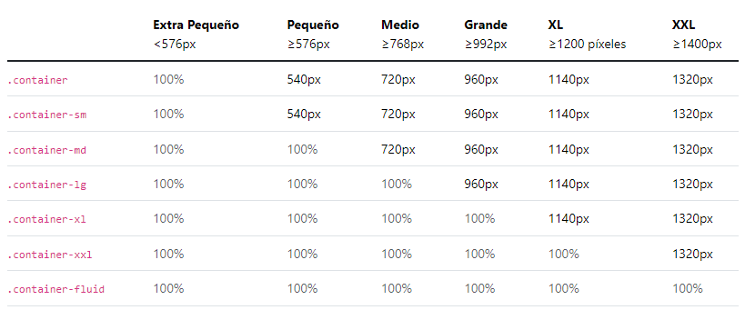

# BOOTSTRAP en HTML y CSS

## ¿Que es Bootstrap?

Bootstrap es un framework de código abierto para el desarrollo rápido y sencillo de sitios web y aplicaciones web responsivas. Proporciona un conjunto de herramientas front-end,como plantillas de diseño,tipografías,formularios,botones y componentes interactivos y permiten a los desarrolladores crear interfaces de usuario atractivas y funcionales de manera eficiente.

## ¿Que es un Framework?

Un framework es una estructura o conjunto de herramientas predefinidas que facilitan la creación de sitios web y aplicaciones web al proporcionar funciones y abstracciones comunes específicamente para este propósito. Los frameworks pueden incluir bibliotecas,plantillas,convenciones de codificación y otros componentes que aceleran el proceso de desarrollo al evitar que los desarrolladores tengan que reinventar la rueda cada vez que escriben código. Además, los frameworks suelen promover buenas prácticas de programación y estandarizar ciertos aspectos del desarrollo,lo que facilita la colaboración en equipos y la mantenibilidad a largo plazo de los proyectos.

## ¿Como podemos incluir bootstrap en nuestro HTML?

Para utilizar bootstrap en nuestro HTML solo necesitamos ir a su pagina web y copiar su CDN (Content Delivery Network) y enlanzarlo en nuestro HTML pero antes hay 2 enlaces que son:

## CSS de bootstrap

```html
<link href="https://cdn.jsdelivr.net/npm/bootstrap@5.3.3/dist/css/bootstrap.min.css" rel="stylesheet" integrity="sha384-QWTKZyjpPEjISv5WaRU9OFeRpok6YctnYmDr5pNlyT2bRjXh0JMhjY6hW+ALEwIH" crossorigin="anonymous">
```

Este enlace permite a tu página web acceder al archivo CSS de Bootstrap. Al incluirlo en tu HTML,tu página podrá utilizar todas las clases y estilos predefinidos de Bootstrap para darle un diseño moderno y responsivo sin necesidad de escribir CSS personalizado.

## JS de bootstrap

```html
<script src="https://cdn.jsdelivr.net/npm/bootstrap@5.3.0-alpha1/dist/js/bootstrap.bundle.min.js"></script>
```

Este script proporciona la funcionalidad de JavaScript necesaria para los componentes de Bootstrap,como los menús desplegables,los modales y los formulario. Al incluirlo en tu página HTML habilitas estas características dinámicas de Bootstrap para mejorar la experiencia del usuario y la interactividad de tu sitio web.

# Breakpoints en Bootstrap

## Contenedores diseñados por Bootstrap

Los contenedores son un componente fundamental de Bootstrap que contienen, rellenan y alinean su contenido dentro de un dispositivo o ventana gráfica determinado. Los contenedores son el elemento de diseño más básico en Bootstrap y son necesarios cuando utilizamos nuestro sistema de cuadrícula predeterminado. Los contenedores se utilizan para contener,rellenar y (a veces) centrar el contenido dentro de ellos. Si bien los contenedores se pueden anidar,la mayoría de los diseños no requieren un contenedor anidado.

Bootstrap viene con tres contenedores diferentes:

- .container: Establece un max-width cada punto de interrupción de respuesta.
- .container-{breakpoint}: es un width: 100% hasta el punto de interrupción especificado.
- .container-fluid: está width: 100% en todos los puntos de interrupción.

La siguiente tabla ilustra cómo se compara cada contenedor max-width el original .containery .container-fluid cada punto de interrupción.




